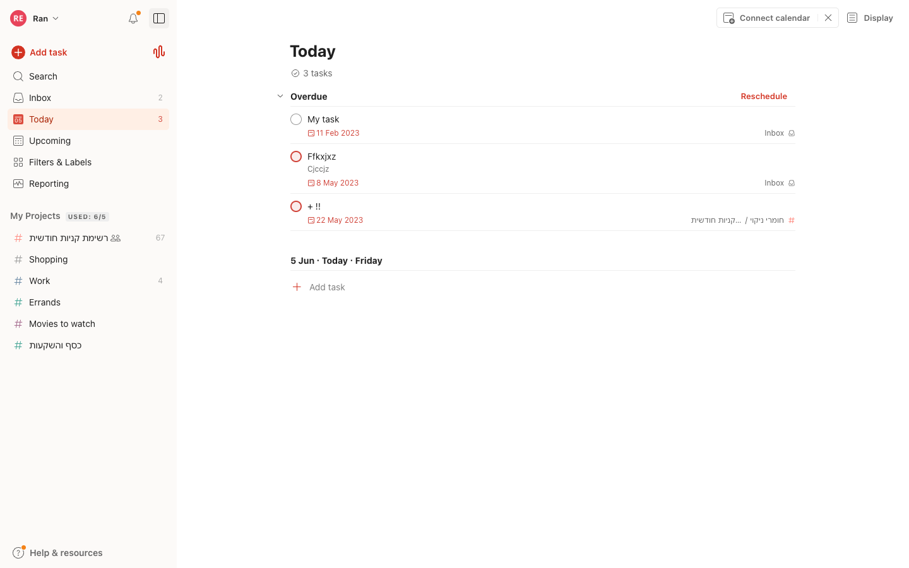
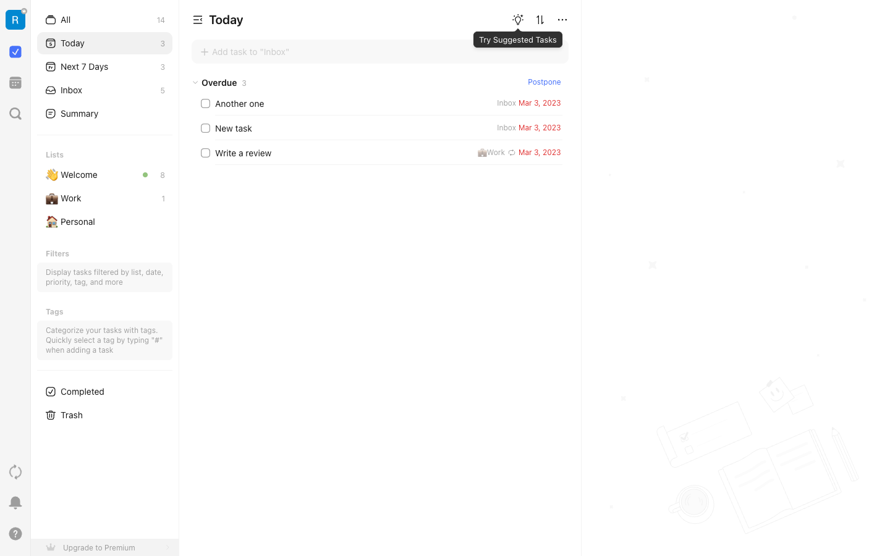

# Competitor comparison: Scheduled task features

> **Date:** 2026-06-05
> **Competitors:** todoist, ticktick
> **Run folder:** Outputs/competitor-research/scheduled-tasks-2026-06-05/

## Scope

How **Todoist** and **TickTick** let users **schedule tasks in time** — assigning dates/times, durations, recurrence, calendar-based planning, and time-oriented list views (Today, Upcoming, etc.). Focus is individual task scheduling, not team project management.

## Capability comparison

| Capability | todoist | ticktick |
|------------|---------|----------|
| Quick capture with date NLP | Yes — Quick Add parses natural language dates/times in task name | Yes — "+ Add task" in list; NLP in help docs |
| Date-only scheduling | Yes — scheduler or NLP | Yes — Date & Reminder; shortcuts Today/Tomorrow/Next Week |
| Date + specific time | Yes — NLP or scheduler Time field | Yes — dates on tasks; recurring icon on list rows |
| Task duration / time block | Yes — `for 2h` NLP; max 24h; requires date+time | Yes — **Duration** mode with start/end; **multi-day** via All Day span |
| Separate deadline vs planned date | Yes — **Deadline** field + `{date}` NLP (Pro) | Not documented as separate deadline concept — due date + reminders |
| Recurring schedules | Yes — rich NLP (`every 3rd Friday`, etc.) | Yes — daily/weekly/monthly/yearly/custom; **3 repeat modes**: By Due Dates, By Completion Date, By Specific Dates |
| Edit single recurrence instance | Yes — recurring task menu options | Yes — calendar edit → **Only this Recurrence** |
| Skip / defer recurrence cycle | Via complete/reschedule semantics | Yes — **Skip this Recurrence** in calendar/list |
| Show future repeat instances on calendar | [NEED: verify] | Yes — **Show All Repeat Cycles** / Show Future Cycles in calendar view options |
| Calendar views for scheduling | Pro/Business calendar layout (duration overview) | **Built-in**: year, month, week, day, agenda, multi-week; drag-to-reschedule |
| Drag tasks to reschedule on calendar | [NEED: verify logged-in UI] | Yes — drag task to date; **Arrange Tasks** mode; batch postpone (desktop) |
| Time-oriented smart lists | Yes — **Today** (active), **Upcoming** in sidebar | Yes — **Today** (3), **Next 7 Days** (3), **All** (14) with counts |
| Workload visibility on a day | Task count on Today (3); per-project counts in sidebar | Today count (3); **Overdue 3** section header |
| Date color coding | Yes — **red** overdue dates visible on Today view | Yes — **red** overdue dates (e.g. Mar 3, 2023) |
| Multi-timezone scheduling | [NEED: verify] | Yes — **Additional Time Zone** in calendar view options |
| Constant / nagging reminders | Standard reminders | Yes — **Constant Reminder** until task completed (per marketing site) |
| Postpone / reschedule flows | Yes — **Reschedule** link on Overdue section (Today view) | Yes — **Postpone** link on Overdue section (Today view) |

## Screenshots

### todoist

| State | Screenshot | URL captured |
|-------|------------|--------------|
| main |  | https://app.todoist.com/app/today (authenticated Today view) |

### ticktick

| State | Screenshot | URL captured |
|-------|------------|--------------|
| main |  | https://ticktick.com/webapp/#q/today/tasks (authenticated Today view) |

## Per-competitor notes

### todoist

- **Today view** groups **Overdue** tasks separately with a **Reschedule** action; current day section shows date header (e.g. `5 Jun · Today · Friday`).
- Sidebar shows **Today** and **Upcoming** with **task counts** (Today: 3, Inbox: 2); overdue task dates render in **red** with project attribution.
- **Connect calendar** promo banner visible at top of Today view.
- Scheduling is **task-view centric**: open task → **Date** scheduler on right sidebar; NLP also works inside scheduler field.
- **Quick Add** is the fastest path — dates, recurrence, and `{deadlines}` parsed from one line; false positives demoted by clicking highlighted tokens.
- **Deadline vs date** is a distinct model: date = when you plan to work; deadline = fixed cutoff (Pro).
- **Duration** requires time component; capped at 24 hours; no native multi-day duration block.
- **Color semantics** encode urgency horizon (overdue red → today green → tomorrow brown → week purple).
- Scheduler shows **daily workload bar** by project to discourage overload on a single day.

### ticktick

- **Today view** shows **Overdue 3** section with **Postpone** action; overdue dates in **red** (Mar 3, 2023).
- Sidebar smart lists with counts: **All** (14), **Today** (3), **Next 7 Days** (3), **Inbox** (5).
- **Recurring task** icon visible on task row (e.g. "Write a review" in Work list).
- **Suggested Tasks** lightbulb in header; sort and overflow menu on Today view.
- Positions as **to-do + calendar** — scheduling is a first-class surface, not only a task property.
- **Duration** supports same-day ranges (9:00–12:00) and **multi-day** spans via All Day extension — stronger for time-blocking than Todoist’s 24h cap.
- **Recurrence** exposes three semantic modes (due-date vs completion-date vs specific dates) — more explicit than Todoist’s completion-advance rules.
- **Calendar view options** are dense: show repeat cycles, habits, focus records, check items, completed tasks, additional timezone.
- Marketing/product UI shows **time on list rows** (e.g. 07:00, 09:00) and **Today / Tomorrow** sections with counts — scheduling is visible without opening task detail.
- **Skip this Recurrence** and edit **Only this Recurrence** support flexible calendar hygiene.

## Supplemental docs

| Competitor | Doc | URL |
|------------|-----|-----|
| todoist | Introduction to dates and time | https://www.todoist.com/help/articles/introduction-to-dates-and-time-q7VobO |
| todoist | Introduction to recurring dates | https://www.todoist.com/help/articles/introduction-to-recurring-dates-YUYVJJAV |
| todoist | Introduction to deadlines | https://www.todoist.com/help/articles/introduction-to-deadlines-in-todoist-uMqbSLM6U |
| todoist | Set a task duration | https://www.todoist.com/help/articles/set-a-task-duration-L1kYkZv8d |
| todoist | Use Task Quick Add | https://www.todoist.com/help/articles/use-task-quick-add-in-todoist-va4Lhpzz |
| ticktick | Task Details and Editing (Date & Duration) | https://help.ticktick.com/articles/7055782408586526720 |
| ticktick | Set Up Recurring Tasks | https://help.ticktick.com/articles/7055782206349770752 |
| ticktick | Calendar View Options | https://help.ticktick.com/articles/7055782085826445312 |
| ticktick | FAQ (calendar arrange, skip recurrence) | https://help.ticktick.com/articles/7055792921664028672 |

## Data quality

- **Login failures:** none — both competitors captured with saved CloakBrowser sessions.
- **Missing states:** `create`, `edit` for both; calendar views not captured.
- **Plan-gated UI:** Todoist deadlines and some calendar/duration features documented as Pro; TickTick Premium upsell visible in sidebar.
- **Assumptions:** Task-view date pickers and calendar drag-and-drop not captured in this run; capability rows otherwise from help docs + Today screenshots.

## Next steps (optional)

Re-run `create`/`edit` state captures or calendar views for deeper UI comparison. For TBD gap analysis vs these patterns, run gap workflow or `/02-pm-planner`.
